

## Montag, 3. Juli 2017

    

Flug LH498 hat uns zwar mit Verspätung, aber sicher, von Frankfurt am Main nach Mexiko-Stadt gebracht. In Mexiko ist es kühler als erwartet: Die Regenzeit beginnt.

## Dienstag, 4. Juli 2017

    

Das erste Interview der Reise findet mit Andreas Müller von der [AHK Mexiko-Stadt](https://mexiko.ahk.de/) statt. Er betont, dass sich deutsche Unternehmen bei der dualen Ausbildung (nach deutschem Vorbild) z.T. deutlich über das erforderliche Maß hinaus engagieren. Einige Unternehmen bilden über ihren eigenen Bedarf hinaus aus und unterstützen damit den Aufbau eines dualen Ausbildungssystems in Mexiko. Gleichzeitig fragt er sich, ob die deutschen Unternehmen bzgl. Compliance z.T. nicht «zu viel» machen.

## Mittwoch, 5. Juli 2017

    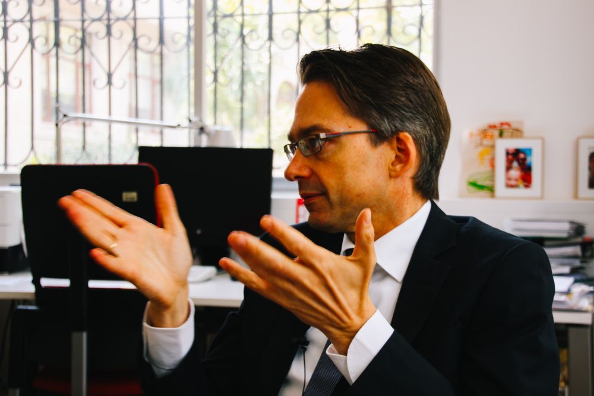

Oliver Knoerich von der [Deutschen Botschaft Mexiko-Stadt](http://www.mexiko.diplo.de/Vertretung/mexiko/de/Startseite.html) berichtet, dass deutsche Unternehmen sich an staatlichen Ausschreibungsverfahren z.T. nicht beteiligen, weil sie keine Chance sehen zum Zuge zu kommen, wenn Sie integer bleiben wollen. Das Thema Compliance müsse von zwei Stoßrichtungen angegangen werden: zum einen vom mexikanischen Staat, zum anderen von den ausländischen Unternehmen.

    

Berliner Bär vor der Deutschen Botschaft in Mexiko-Stadt.

## Donnerstag, 6. Juli 2017

In den noblen Wohnvierteln wie [La Condesa](https://goo.gl/maps/jo1qWxpyToD2) oder [Polanco](https://goo.gl/maps/qzcDVtVaoLK2) gibt es permanent fließendes Wasser. In anderen Gegenden des Großraums Mexiko-Stadt wird das Leitungswasser regelmäßig rationiert oder per LKW (Camion Pipa) angeliefert.

## Freitag, 7. Juli 2017

    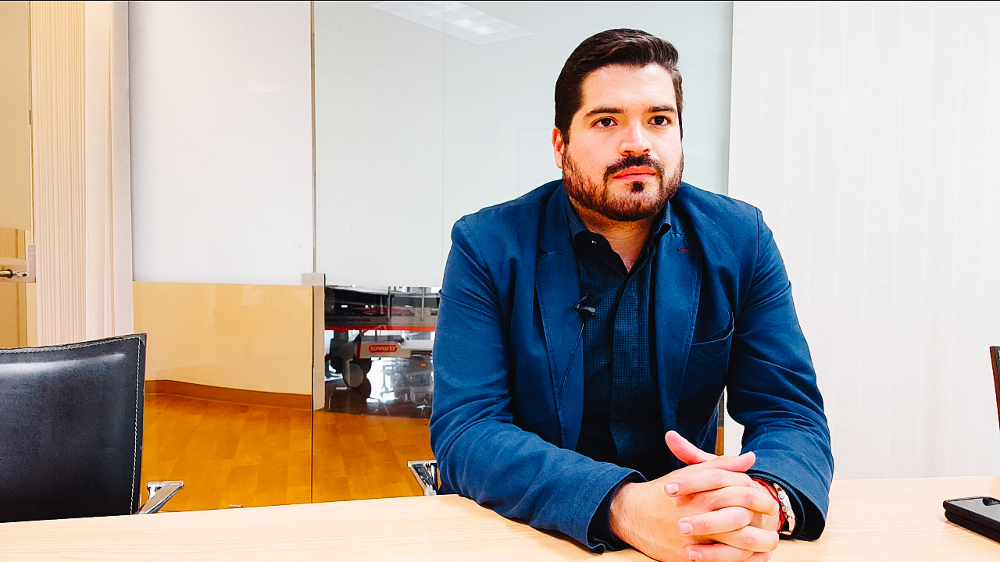

Nach Einschätzung von Augusto Martínez von [Draeger Mexico](https://www.draeger.com/es_mx/Home) ist die Definition von Korruption überall auf der Welt die gleiche, ohne kulturelle Unterschiede. Demnach bedeutet Korruption die Regeln auf irgendeine Weise zu umgehen, um sich einen Vorteil zu verschaffen. «Corrupción es brincar la ley mediante algún medio a ventajarse».

    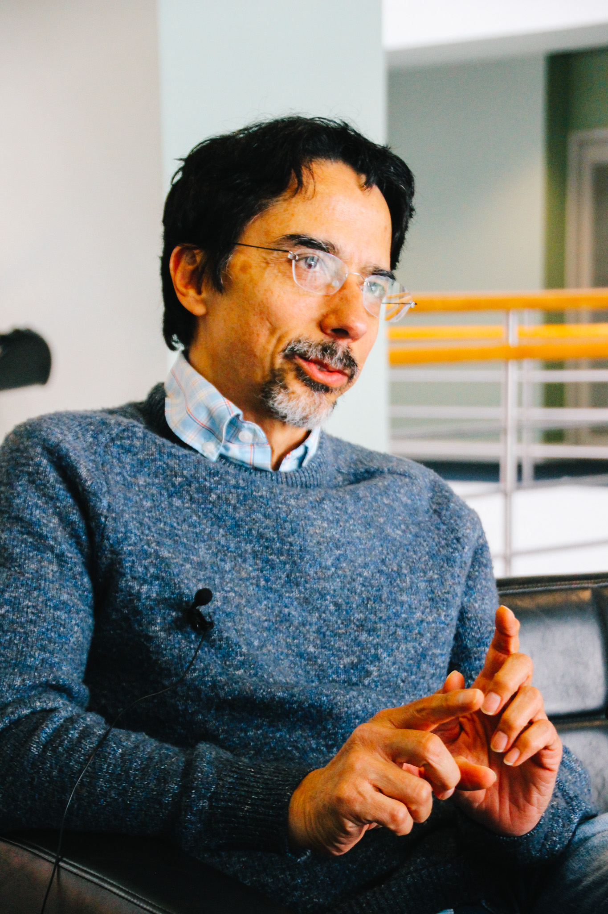

Alberto Equihua vom Ableger des [BDI](http://www.bdi-mexico.com/) in Mexiko merkt an, dass in Mexiko die Meinung weit verbreitet sei, dass soziale Verantwortung ein Luxus für die Unternehmen sei, die es sich leisten können.

## Samstag, 8. Juli 2017

    

Die Mexikaner lieben es süß... ;-)

## Sonntag, 9. Juli 2017

    

        <iframe src="https://www.youtube.com/embed/Qy3tKmrhDhc?ecver=1" allowfullscreen></iframe>
    

Heute erhalten wir einen Einblick in ein «anderes Mexiko»: Der Wochenmarkt im Municipio Coacalco de Berriozábal im Bundesstaat México wird wohl eher selten von Ausländern besucht. Auf dem Rückweg erleben wir, wie schnell die Straßen bei Regen überfluten und zu kleinen Flüssen werden.

    

        <iframe src="https://www.youtube.com/embed/rK-RXRPBzAo?ecver=1" allowfullscreen></iframe>
    

In der Peripherie Mexiko-Stadts funktioniert die kommunale Müllentsorgung nicht richtig. Private Müllsammler füllen diese Lücke.

## Montag, 10. Juli 2017

Stefan Jost, Leiter des KAS-Auslandsbüros in Mexiko berichtet, dass in Mexiko großer Patriotismus vorhanden sei, gleichzeitig aber wenig Vertrauen in die Regierung herrsche. Die Haltung «je weniger ich von den offiziellen Strukturen abhängig bin, desto besser bin ich dran», stärke den informellen Sektor.

    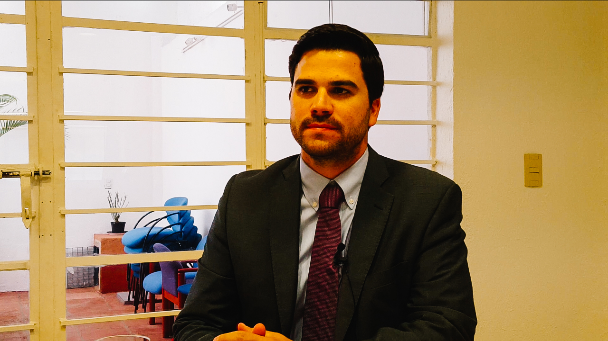

Jorge Aguirre, Jungunternehmer aus dem Bundesstaat Sonora betont, dass bei der Korruption, wie bei einer Treppe, von oben nach unten gefegt werden müsse, sonst funktioniere es nicht.

## Dienstag, 11. Juli 2017

Der Smart-TV in der Unterkunft empfängt kein normales, lineares Fernsehprogramm. Lediglich YouTube und Netflix stehen über das Internet zur Verfügung.

## Mittwoch, 12. Juli 2017

    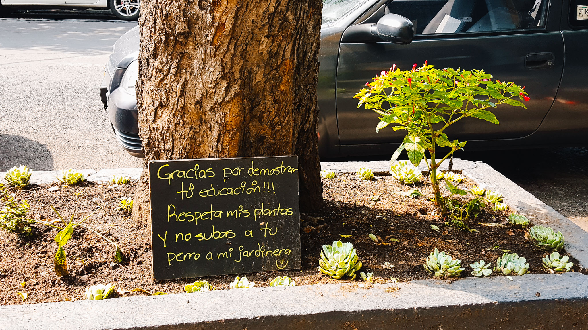

Urban-Gardening-Versuche in Mexiko-Stadt müssen sich gegen Hundekot zur Wehr setzen.

## Donnerstag, 13. Juli 2017

    

        <iframe src="https://www.youtube.com/embed/xy-32g5lJGM?ecver=1" allowfullscreen></iframe>
    

Stadtverkehr auf der Avenida Arcos de Belén

Bei der Veranstaltung «Bonos de Impacto en México: oportunidades y retos» wird über einen innovativen Finanzierungsmechanismus für soziale Programme diskutiert. Mittels Social Impact Bonds finanzieren private, wirkungsorientierte Investoren ein soziales Vorhaben vor. Nur wenn dieses seine vereinbarte Wirkung erzielt, werden die Investoren vom öffentlichen Auftraggeber rückvergütet. Eine große Hürde für den Ansatz ist das fehlende Vertrauen darauf, dass der mexikanische Staat die eingegangenen Verpflichtungen im Erfolgsfall auch tatsächlich erfüllt.

## Freitag, 14. Juli 2017

    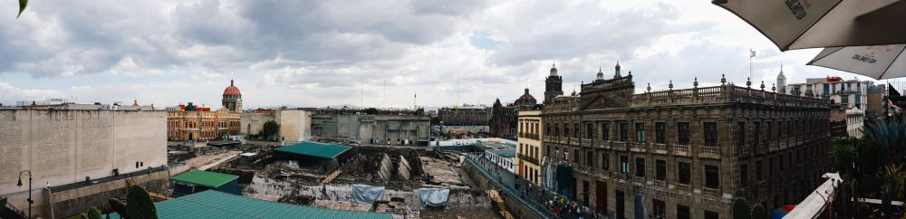

Im Zentrum von Mexiko-Stadt wird das aztekische Erbe freigelegt. Als die Spanier 1519 die damalige Azteken-Hauptstadt namens Tenochtitlan erreichten, lag diese auf mehreren Inseln im Texcoco-See. Dieser ist heute weitgehend ausgetrocknet. Die schiefen Wände vieler kolonialer Bauwerke lassen aber auf den weichen Untergrund schließen, auf dem diese errichtet wurden.

## Samstag, 15. Juli 2017

    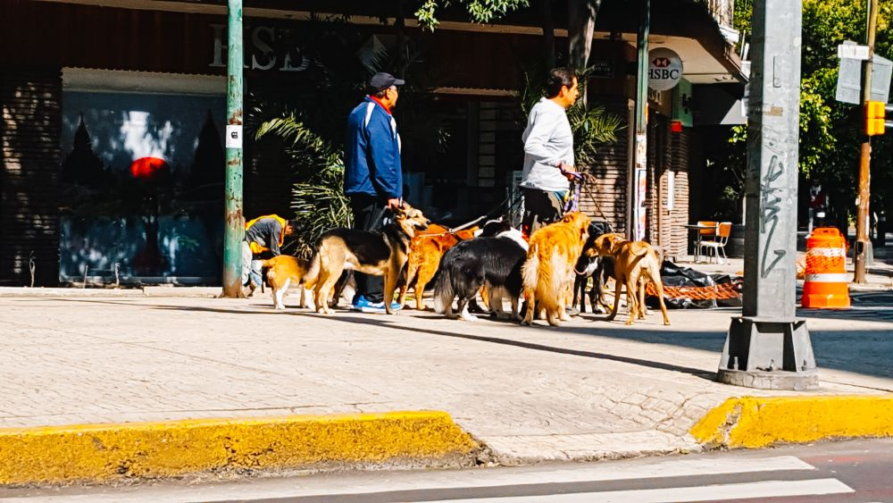

Walk the dog – Hundesitter sind in Mexiko-Stadt weit verbreitet. Beliebtes Gassirevier ist der Parque México, in dem sich ein sehr schöner Hundespielplatz befindet.

    

        <iframe src="https://www.youtube.com/embed/vKo4ZlsWgIo?ecver=1" allowfullscreen></iframe>
    

Mülltrennung auf mexikanische Art.

## Sonntag, 16. Juli 2017

    

Best Süssgebäck ever vom Straßenmarkt in San Angel :-)

    

        <iframe src="https://www.youtube.com/embed/OlUja9zXNfw?ecver=1" allowfullscreen></iframe>
    

Am Rande eines Straßenmarktes im Stadtteil San Angel bietet ein schamanischer Heiler seine Dienste an. Diese erfreuen sich reger Nachfrage.

## Montag, 17. Juli 2017

    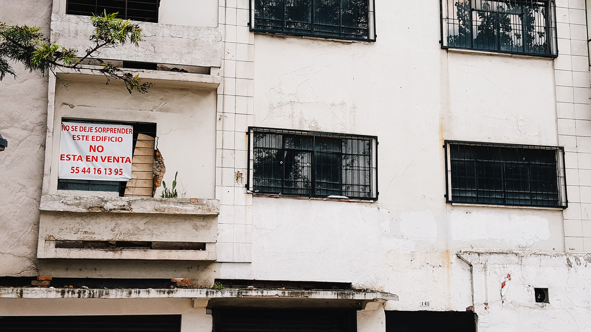

Nicht-zu-verkaufen: Anwohner kämpfen gegen die Gentrifizierung ihres Viertels, die nach ihrer Einschätzung auch mithilfe von Korruption vorangetrieben wird.

## Dienstag, 18. Juli 2017

    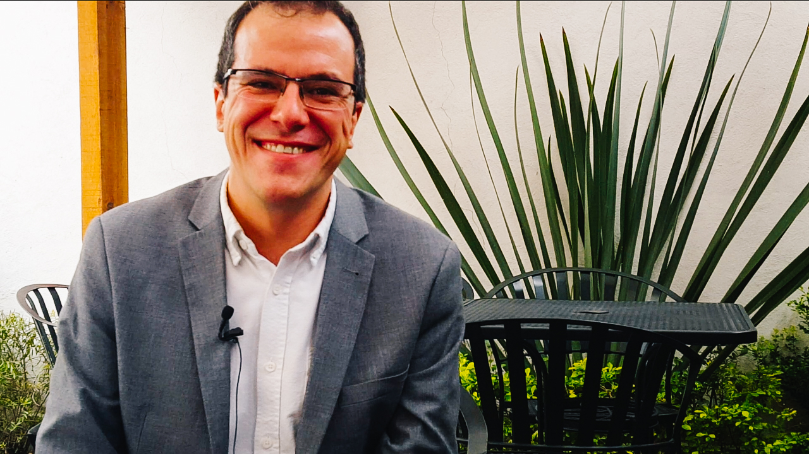

Javier Mestre, von Corresponsables hebt hervor «Was nicht gemessen wird, kann nicht verbessert werden». Daher müsse Nachhaltigkeit in den Unternehmen gemessen werden. Darüber hinaus betont er, dass es auf die soziale Verantwortung von Unternehmen kein Urheberrecht geben dürfe. Dennoch kommunizieren einige Unternehmen ihr Engagement nicht, damit sie nicht kopiert werden können. Diesen Ansatz hält er für falsch.

    

Der Taco al pastor ist eine in Mexiko sehr beliebte Taco-Art mit Schweinefleisch. Wer hat‘s erfunden? Die Betreiber des Restaurants [El Tizoncito](https://www.eltizoncito.com.mx/) beanspruchen, dass sie es waren.

## Mittwoch, 19. Juli 2017

    

Lorena Cortes von [CEMEFI](https://www.cemefi.org/) weist darauf hin, dass es in Mexiko gut angesehen sei, möglichst viel Zeit auf der Arbeit zu verbringen. Daher sei es eines der Länder, in denen die meisten Arbeitsstunden geleistet würden, gleichzeitig sei die Produktivität aber mit am geringsten. Hierfür gibt es ein geflügeltes Wort: «Hacer horas nalgas», Stunden machen, in denen man nichts tut.

In Mexiko wird reich sein häufig mit «ein Schuft sein» gleichgesetzt. Die Leute denken, dass man etwas Unrechtes getan haben muss, um reich geworden zu sein. Arm zu sein bedeutet, dass man nicht studieren bzw. arbeiten wolle, sondern faul sei.

In Mexiko ist die Ungleichheit ein größeres Problem als die Armut. Vor allem die Ungleichheit vor dem Gesetz und bzgl. des Zugangs zur Justiz ist frappant: «El que no tiene dinero no tiene a quien le defienda» («Wer kein Geld hat, hat niemanden, der ihn verteidigt»).

    <audio controls>
        <source src="../media/audio/Sprachansage_Ankauf_Matratzen_etc-MexicoStadt_20170719_bearbeitet.mp3" type="audio/mpeg">
        Your browser does not support the audio element.
    </audio>

Eine Sperrmüllsammlerin fährt durch die Straßen und macht mithilfe eines Megaphons auf sich aufmerksam.

## Donnerstag, 20. Juli 2017

    

Gespräch bei Roche. Einkaufschef Arturo Alonso schildert, wie das Schweizer Pharmaunternehmen Nachhaltigkeit in seiner Lieferkette sicherstellt. Nach seiner Erfahrung können lokale Zulieferer viel von multinationalen Unternehmen lernen. Gleichzeitig sind die lokalen Zulieferer wichtig für die multinationalen Unternehmen. Der gezielte Austausch mit den Zulieferern über das Thema Nachhaltigkeit wird auch als Triebfeder für Innovationen genutzt.

## Freitag, 21. Juli 2017

Netflix-Abend: In der satirischen Filmkomödie [«La dictadura perfecta»](http://www.imdb.com/title/tt3970854/?ref_=nv_sr_1) hilft ein einflussreicher Fernsehsender gegen ein hohes Bestechungsgeld einem notorisch korruptem Gouverneur sein Image zu verbessern und mexikanischer Präsident zu werden. Nach allem, was wir über das politische System Mexikos erfahren haben, leider kein abwegiger Plot.

## Samstag, 22. Juli 2017

    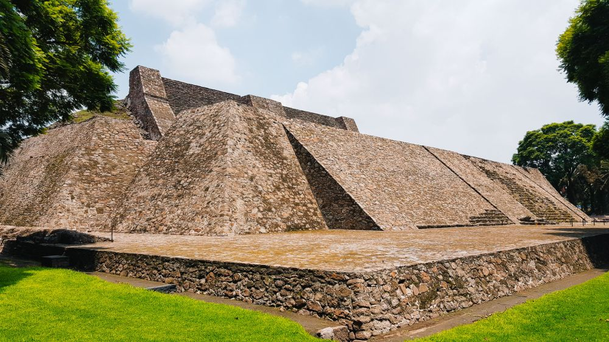

Der Eintritt zur [Pyramide von Tenayuca]( https://de.wikipedia.org/wiki/Tenayuca_(Mexiko)) kostet normalerweise 50 MXN pro Person. Zurzeit ist er jedoch kostenlos, da die Kasse aufgrund eines Lieferengpasses über keine Tickets verfügt.

## Sonntag, 23. Juli 2017

    

        <iframe src="https://www.youtube.com/embed/YyB1oLtOF-o?ecver=1" allowfullscreen></iframe>
    

Nach 16 Tagen und 450 km Fußmarsch zogen heute ca. 50‘000 Pilger aus der Stadt Querétaro in der [Basilika Santa María de Guadalupe](http://basilica.mxv.mx/web1/-home/index.html) ein.

## Montag, 24. Juli 2017

Wir erwarten eine wichtige Expresssendung mit TNT. Diese entwickelt sich zum Reinfall. Nach einer Odyssee durch Europa ist die Sendung bereits zehn Tage überfällig und es besteht wenig Hoffnung, dass sie noch rechtzeitig vor unserer Weiterreise ankommt.

## Dienstag, 25. Juli 2017

    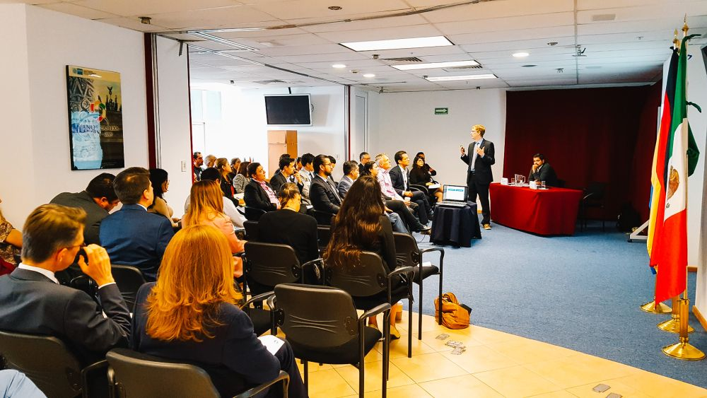

Der erste Vortrag der Forschungsreise findet bei der AHK Mexiko statt. An der Veranstaltung zum Thema Korruptionsprävention nehmen rund 60 Personen teil. Dies unterstreicht das Interesse der Unternehmen an der Thematik. Die Veranstaltung dient gleichzeitig als Auftaktevent für eine neue AHK-Arbeitsgruppe zum Thema Compliance. Besten Dank an Gabriel Carranza und sein Team!

Ein deutscher Kleinunternehmer hat während seiner Tätigkeit in Mexiko folgendes gelernt: Wichtiger als jemanden im Unternehmen zu haben, der die Gesetze kennt, ist es, jemanden zu kennen, der weiß zu wem man gehen muss, um Dinge zu erreichen.

Nach 23 Tagen in Mexiko-Stadt geht es heute mit Flug AV2653 über Nacht weiter nach Lima. Abflug ist um 23:50 Uhr.

